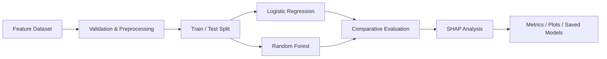

# Predictive Modelling Pipeline

> A reproducible end-to-end classification workflow covering feature preparation, model comparison, evaluation, SHAP interpretability and model persistence.

[](https://www.python.org/)
[](https://scikit-learn.org/)
[](https://shap.readthedocs.io/)

## Problem

This project demonstrates how behavioural features can be transformed into predictive signals and evaluated as a reusable analytics workflow.

The emphasis is broader than accuracy:

**reproducibility → evaluation → interpretability → operational reuse**

## Pipeline architecture



## Models

- **Logistic Regression** — transparent baseline
- **Random Forest** — non-linear tree-based model

Evaluation includes accuracy, precision, recall and ROC-AUC.

## Explainability

SHAP analysis is used to investigate which features contribute most strongly to predictions. These explanations describe model behaviour and should not be interpreted as causal evidence.

## Outputs

```text
outputs/
├── model_comparison.csv
├── roc_curve.png
└── shap_summary.png

models/
└── *.pkl
```

## Reproduce locally

```bash
git clone https://github.com/Kaviya-Mahendran/predictive-modelling-pipeline.git
cd predictive-modelling-pipeline
pip install -r requirements.txt
python scripts/pipeline.py
```

## Visual outputs

- [Model comparison and evaluation outputs](./outputs/) — generated CSV/plots from the reproducible pipeline.
- [Notebooks](./notebooks/) — exploratory analysis and interpretation.

## Evaluation discipline

The repository deliberately avoids placeholder metrics. Results should be generated from the actual dataset and code version.

| Model | Accuracy | Precision | Recall | ROC-AUC |
|---|---:|---:|---:|---:|
| Logistic Regression | Run pipeline | Run pipeline | Run pipeline | Run pipeline |
| Random Forest | Run pipeline | Run pipeline | Run pipeline | Run pipeline |

### What a production-ready evaluation would add

- Cross-validation
- Time-aware validation where appropriate
- Probability calibration
- Threshold analysis
- Class-imbalance assessment
- Reproducible experiment configuration
- Automated regression tests for model outputs

## Project structure

```text
predictive-modelling-pipeline/
├── scripts/       # pipeline execution
├── models/        # persisted model artefacts
├── outputs/       # metrics and visual outputs
├── notebooks/     # exploration / analysis
├── tests/         # validation and regression tests
└── README.md
```

## Limitations

- Demonstration dataset rather than production data
- Performance depends on feature and label quality
- SHAP is not causal inference
- Real deployment would require calibration, monitoring, drift detection and governance

## Future roadmap

- Time-based validation
- Probability calibration
- Cross-validation
- Automated tests
- Data drift monitoring
- Scheduled execution
- Survival or uplift modelling

**Focus:** predictive analytics · Python · scikit-learn · SHAP · reproducible ML